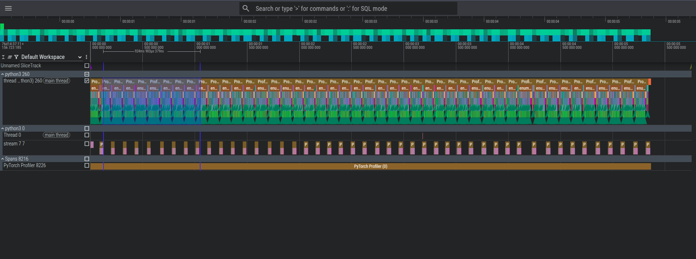

## Результаты дз 1
**[ccылка на tar](https://disk.360.yandex.ru/d/Hs1eWpg188ALVw)**

### Обучение моделей

1. **Простая CNN (трёхслойная)**

   * Сделана для **sanity check**. Цель — проверить, адекватен ли датасет
   * Результат: сеть показала высокую точность (≈97–98%), что подтвердило, что данные чистые и хорошо структурированные.

2. **ViT Tiny (Patch16/224)**
   
   * Дала сопоставимый результат по accuracy (≈96%), при этом показала лучший баланс по классам (macro F1 ≈0.96).
   * Ошибки распределились по близким категориям, что типично для задачи и указывает на то, что ViT извлекает более глобальные признаки.

## Результаты профайлинга

Скриншот профайлера: 

Краткий анализ трассы профайлера:

* Итерации обучения последовательны и регулярны, без долгих простоев GPU между батчами — это указывает на достаточную пропускную способность data pipeline.
* Видны периодические синхронизации (например, при валидации или логировании), что ожидаемо.
* Нет явных узких мест в основном цикле (GPU/CPU utilization распределены равномерно по шагам). Если нужно — можно детализировать и найти горячие операции (например, heavy transforms на CPU или частые host-device sync).

#### Вывод

* Маленькая CNN справилась с задачей и показала, что датасет адекватный.
* ViT обучился как основная модель, дал стабильные результаты и чуть лучше сбалансировал предсказания между классами.
